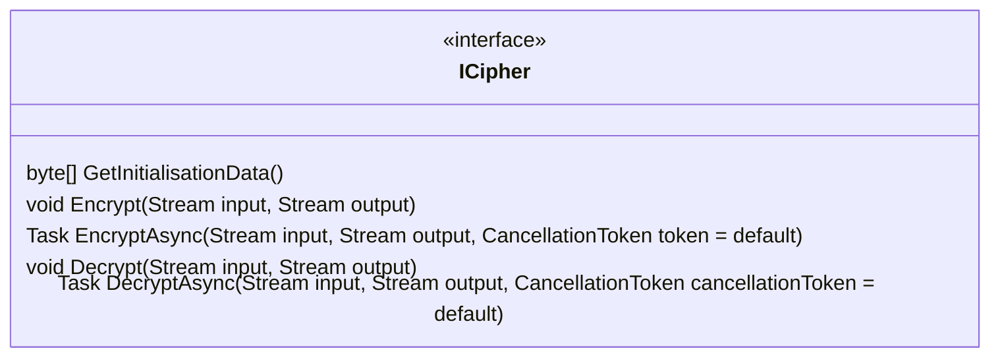
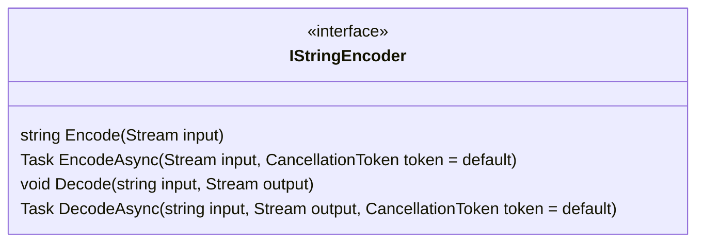
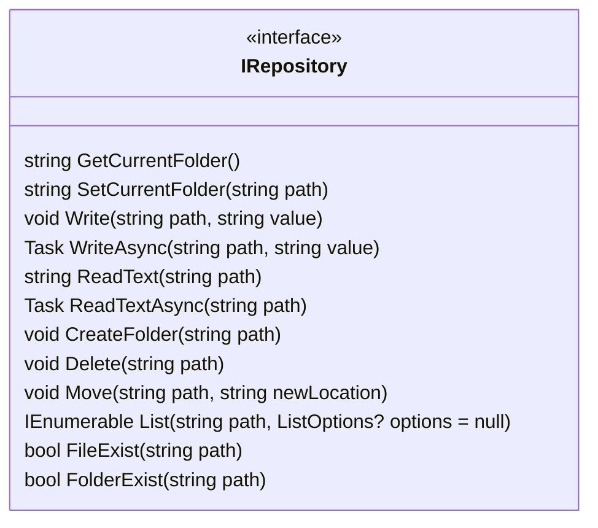

# Types

## ICipher

A cipher. It encrypts and decrypts streams of data. Implementation can provide an initialisation data that can be used to create a new cipher with the same configuration. If the same initialisation data is used to create a cipher, the cipher produces the same output for the same input. 

Implementations: `AesCipher`

## IStringEncoder

A string encoder. It encodes and decodes stream of data to and from strings.

Implementations: `Base64Url`

## IRepository

A repository with encrypted files.

Implementations: `FolderRepository`

Repository paths are relative to the current folder and use forward slashes as separators. For example, the path `folder/file.txt` refers to a file named `file.txt` in a folder named `folder` in the repository's root folder.

Repository names can contain any character except for the forward slash. Repository paths are case-sensitive. The names `.` and `..` are considered folders (current folder and parent folder).
