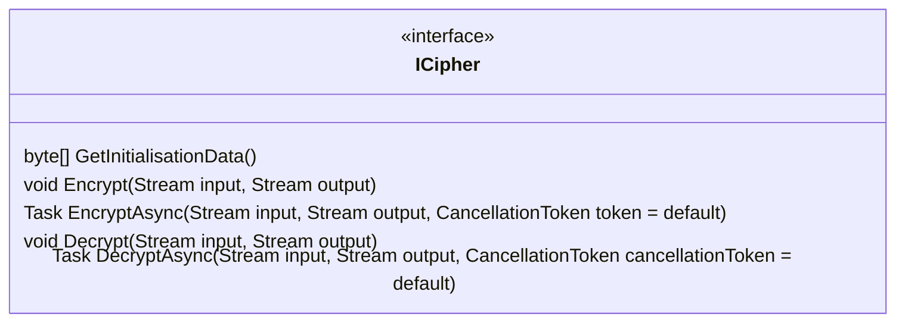
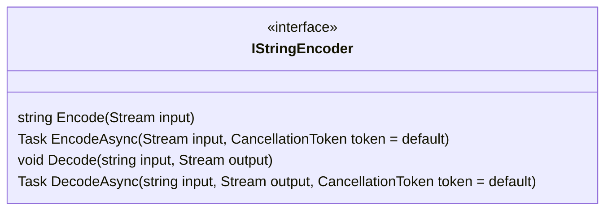
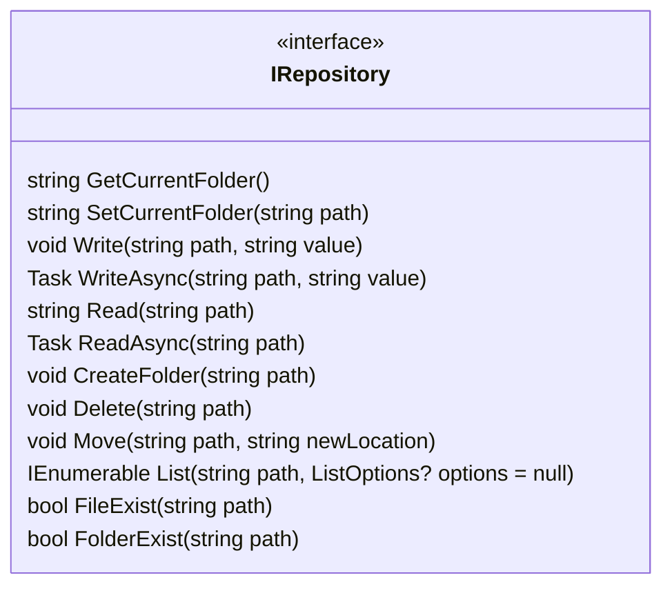

# Types

## ICipher

Interface. Represents a deterministic cipher that can encrypt and decrypt data.

Implementations: `AesCipher`

## IStringEncoder

Interface. Represents a string encoder that can encode and decode strings.

Implementations: `Base64Url`

## IRepository

Interface. Represents a repository that can read and write encrypted files.

Implementations: `FolderRepository`

Repository paths are relative to the repository root and use forward slashes as separators. The root is the repository's root folder. For example, the path `folder/file.txt` refers to a file named `file.txt` in a folder named `folder` in the repository's root folder.

Repository names can contain any character except for the forward slash. Repository paths are case-sensitive. The names `.` and `..` are considered folders (current folder and parent folder, respectively).
