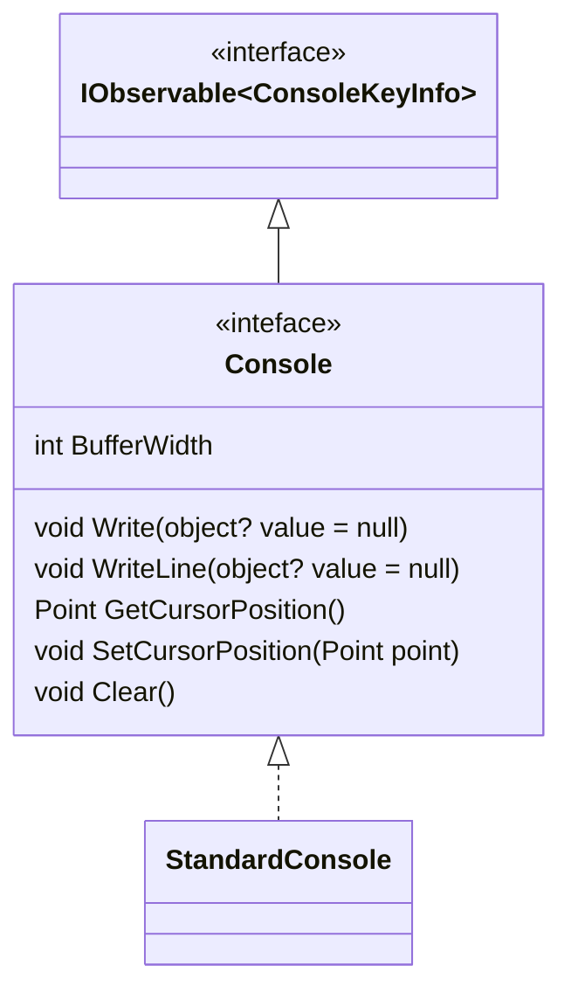
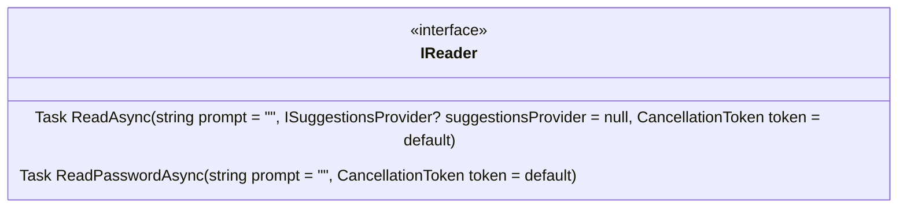
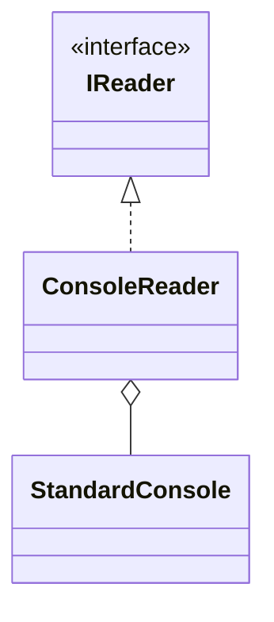
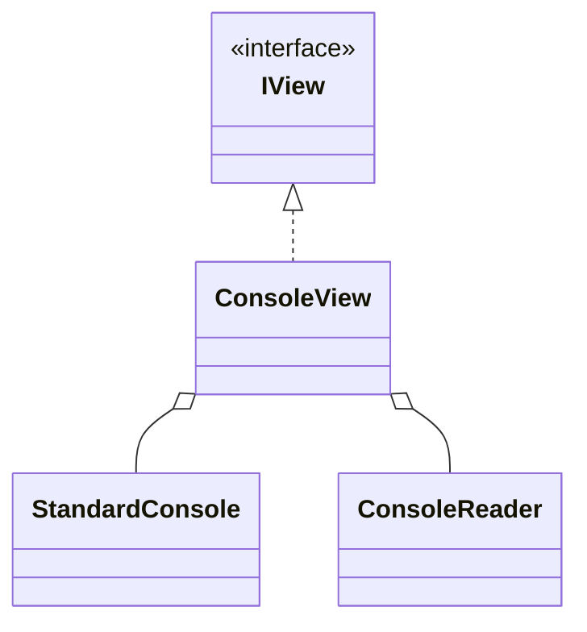

# UI

It is a console application, therefore UI classes represents the console interface.

## Console

## Reader

Reader provides methods for reading user input from the console.

## View

View is a combination of Reader and Console.

## State and contexts

- Context is a representation of a dialog window.
- State is a collection of contexts, piling up on each other.
