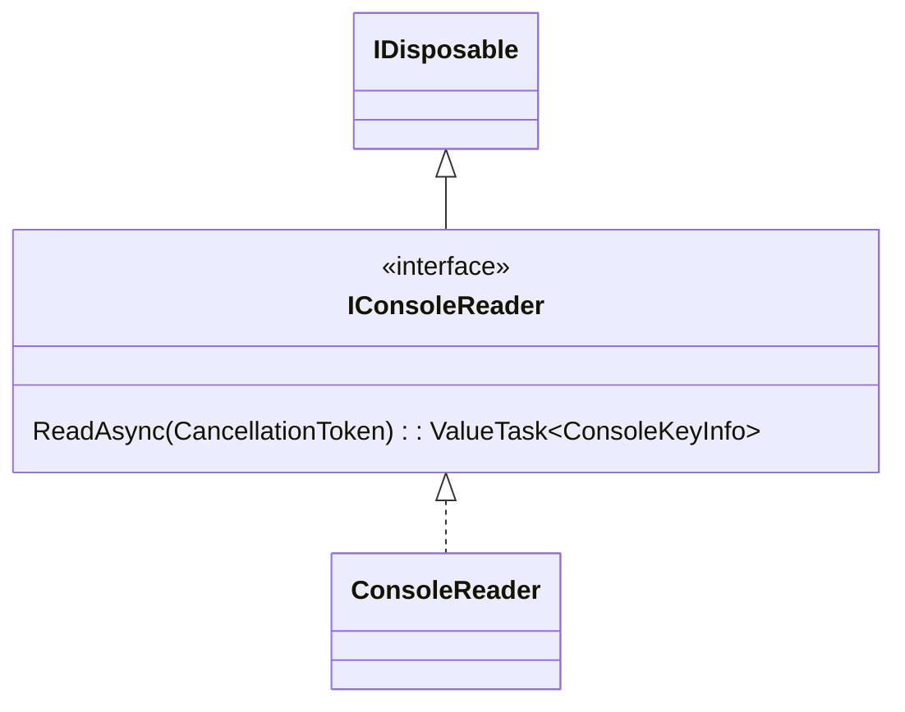
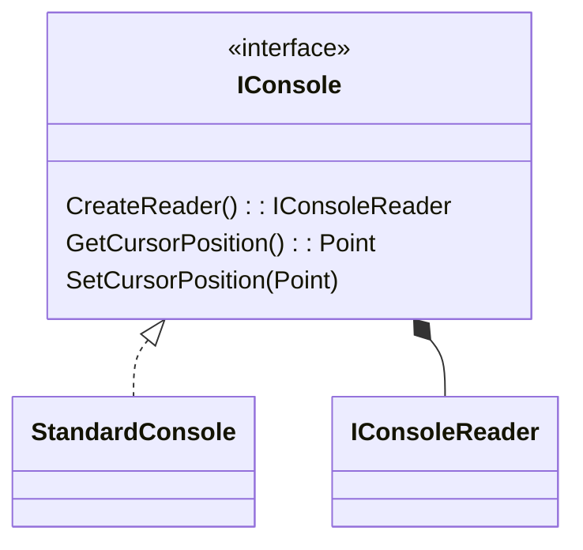

# readline

Asynchonous console utility functions.

```mermaid
classDiagram

IDisposable <|-- IConsoleReader

IConsoleReader <|.. ConsoleReader

class IConsoleReader {
  <<interface>>
  ReadAsync(CancellationToken): ValueTask~ConsoleKeyInfo~
}
```

```mermaid
classDiagram

IConsole <|.. StandardConsole

IConsole *-- IConsoleReader

class IConsole {
  <<interface>>
  CreateReader() : IConsoleReader
  GetCursorPosition() : Point
  SetCursorPosition(Point)
}
```
